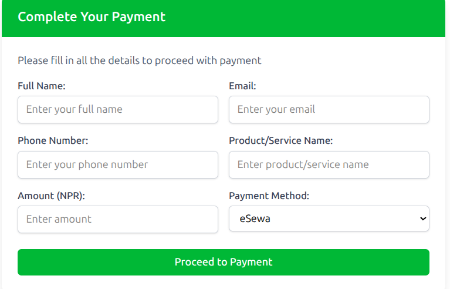
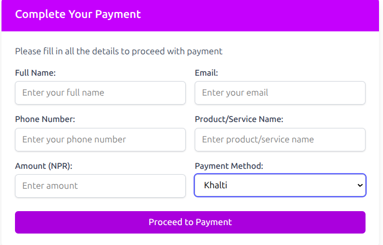
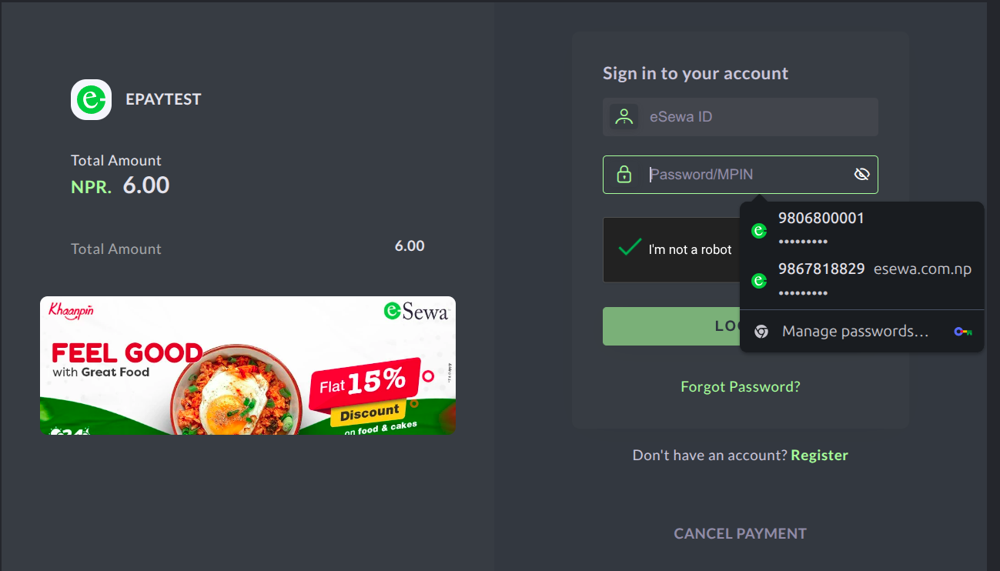
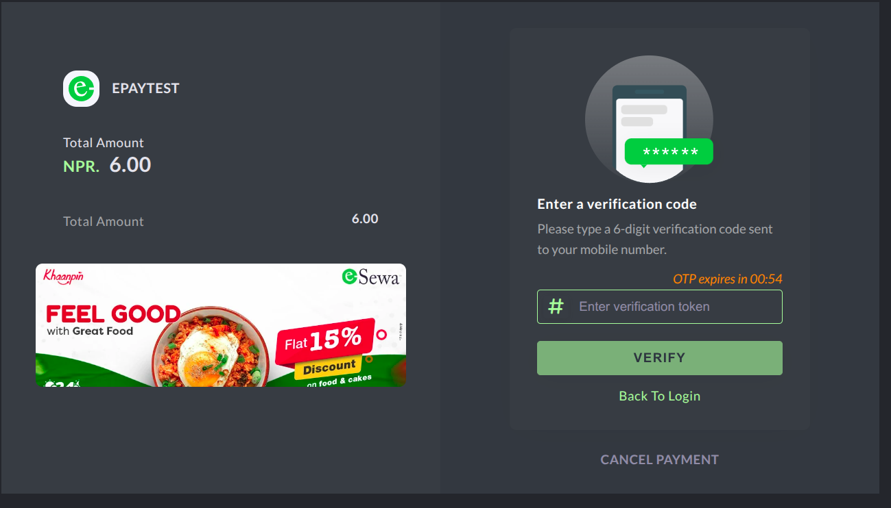
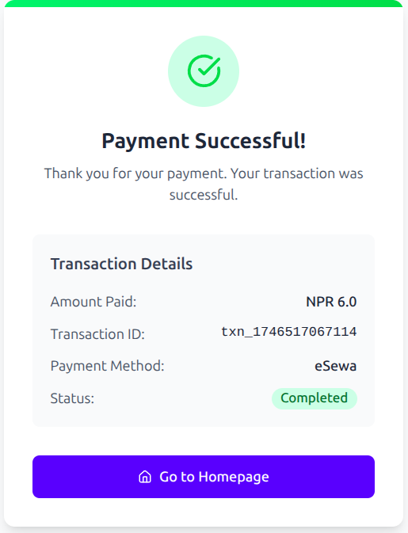

# Online Payment Gateway

This project is a full-stack application for an online payment gateway. Below are the steps to start the backend and frontend of the application.

## Prerequisites

- Node.js installed on your system
- MongoDB installed and running
- A package manager like `npm` or `yarn`

---

## Backend Setup

1. Navigate to the backend directory:

   ```bash
   cd backend
   ```

2. Install dependencies:

   ```bash
   npm install
   ```

3. Create a `.env` file in the backend directory and configure the following environment variables:

   ```env
   MONGO_URI=<your-mongodb-connection-string>
   PORT=<backend-port>
   ```

4. Start the backend server:

   ```bash
   npm start
   ```

   The backend server should now be running on the specified port.

---

## Frontend Setup

1. Navigate to the frontend directory:

   ```bash
   cd frontend
   ```

2. Install dependencies:

   ```bash
   npm install
   ```

3. Start the frontend development server:

   ```bash
   npm start
   ```

   The frontend should now be running and accessible in your browser.

---

## Notes

- Ensure MongoDB is running before starting the backend.
- Update the `.env` file with the correct MongoDB URI and other configurations as needed.
- For production, build the frontend using:
  ```bash
  npm run build
  ```

Feel free to customize this README as per your project requirements.





